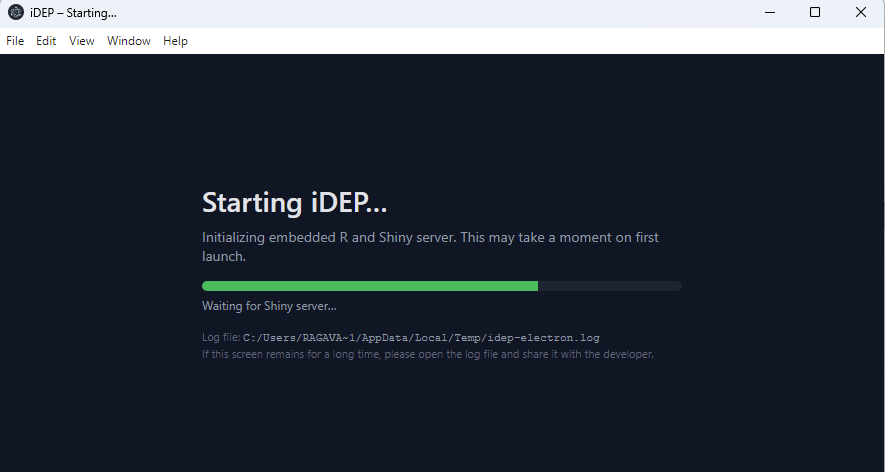
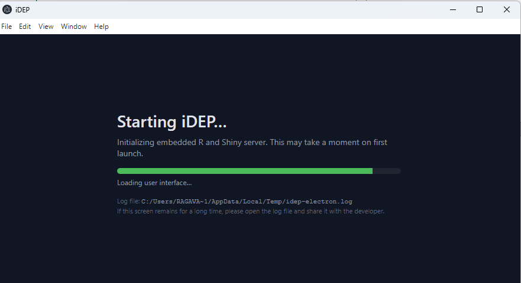

# Packaging & Distribution Guide (Windows, Electron + R)

This document explains how the iDEP Electron app is built, how the embedded R runtime is packaged, and how the CI workflow produces a distributable Windows installer.

---

## 1. Overview

The app is a desktop wrapper around the **iDEP Shiny application**:

- **Frontend**: Electron (Node 20, electron-builder)
- **Backend**: Embedded R (`runtime/R.win`) running `idepGolem::run_app()`
- **Target OS**: Windows 64-bit, MAC (`windows-latest` on GitHub Actions)
- **Bundled R**: Full R runtime mirrored into `electron/runtime`
- **Key extras**:
  - GitHub-installed **ottoPlots** package
  - Bioconductor / CRAN dependencies from the `idepGolem` DESCRIPTION
  - Caching & lazy loading of **demo data** tarball (`data113`)

The **final output** is a Windows installer / executable produced by `electron-builder` under `electron/dist/`.

---

## 2. Installing R Packages into the Bundled Library

All required R packages are installed **into the bundled R library** used at runtime.

### 2.1. Installing `ottoPlots` (GitHub)

The workflow installs **ottoPlots** from GitHub into the bundled library:

### 2.2. DESCRIPTION-based dependencies

Another CI step parses the `idepGolem` `DESCRIPTION` and installs its dependencies into the same bundled library:

- Reads `Depends` and `Imports`
- Strips version ranges, keeps package names
- Splits into:
  - CRAN packages
  - Selected Bioconductor packages (e.g. `DESeq2`, `edgeR`, `GSVA`, `hgu133plus2.db`, `ComplexHeatmap`, etc.)
- Installs:
  - CRAN packages via `install.packages()`
  - Bioconductor packages via `BiocManager::install()`
- Special-cases `ggalt` via `remotes::install_version('ggalt', version='0.4.0', ...)`

This step ensures all runtime dependencies are present in `runtime/R.win/library`.

### 2.3. Installing `idepGolem` into the bundled library

The workflow builds and installs the app’s own R package into the bundled library:

## 3. Staging the Golem App for Electron

`main.js` expects the golem app under `APP_DIR/app`:

- `app/app.R`
- `app/R/` (server/ui code)
- `app/DESCRIPTION`

## 4. Electron Startup Flow (`main.js`)

### 4.1. High-level flow

On `app.whenReady()`:

1. **Splash window**: Renders a custom splash with a progress bar and status text.

2. **Runtime detection**:

3. **Data directory**:

4. **Bootstrap script (`electron_bootstrap.R`)**:
   - Checks if demo data directory already exists and is non-empty.
   - Logs detection of existing demo data.
   - Verifies presence of `ottoPlots` and `idepGolem`.
   - Runs the app

5. **Spawning R**:
   - Progress bar is updated to ~0.5 (“Starting embedded R session…”).

6. **Loading the UI**:
   - Loads `finalURL` in the main `BrowserWindow`.

### 4.2. Demo data caching & skipping repeated work

The demo data tarball is at http://bioinformatics.sdstate.edu/data/data113/data113.tar.gz

## 5. GitHub Actions Workflow (Windows/MAC Build)

The main workflow file (e.g. `.github/workflows/*`) performs the build for MAC and Windows

## 6. Runtime

---
